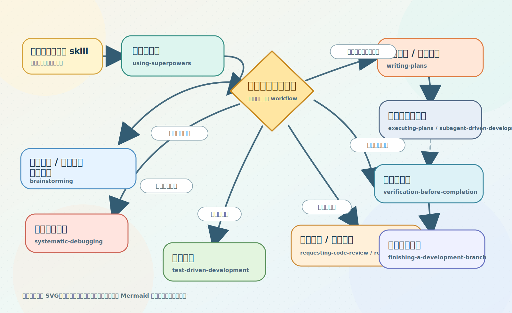

# Superpowers Skill Adapters

把 [`obra/superpowers`](https://github.com/obra/superpowers) 接到 `Cline`、`Claude Code`、`Codex`、`Droid`、`OpenCode`、`CodeBuddy`，补上中文触发、中文文档输出和更稳的安装更新流程。

它不是重写一套中文 skill，而是保留上游能力，再把中文使用体验补齐。

像 `Codex` 这种不能直接照搬上游默认做法的工具，我们会把高风险场景直接限制住，例如不盲目再建 worktree、不假装 branch / push / PR 已经成功。

> 稳定版：[`v0.3.1`](https://github.com/squallopen/superpowers-zh-adapters/releases/tag/v0.3.1)
>
> `v0.3.1` 主要让 AI 安装更便捷。

下文把 `Cline`、`Claude Code`、`Codex`、`Droid`、`OpenCode`、`CodeBuddy` 统称为“工具”。

## 主流程



首页这张图改成了静态 SVG，方便做更清楚的视觉层级；对应 Mermaid 源码保留在 [docs/assets/readme-skill-flow.mmd](docs/assets/readme-skill-flow.mmd)。

更详细的 skill 速查，看这里：

- [简化版能力矩阵](docs/compatibility-matrix.md)

## 功能

- 14 个上游 skill 仍然保留，核心做法还是以上游英文 `SKILL.md` 为准
- 用中文说“需求分析”“总体设计”“详细设计”“实施计划”“代码审查”“单元测试”“集成测试”等，更容易命中对应 skill
- 新建计划、评审、总结、方案这类文档时，优先放到仓库里原本就放文档的位置；如果项目里没有明显约定，再选一个清晰、好找的位置
- 没指定文件名时，默认优先用中文文档名
- 文档正文默认用简体中文，技术术语保留准确表达，但整体尽量写得通俗易懂
- 目前支持 `Cline`、`Claude Code`、`Codex`、`Droid`、`OpenCode`、`CodeBuddy`
- vendored 上游 `obra/superpowers` 当前已同步到 `v5.0.6`

## 让 AI 安装

如果你想让别的 AI agent 直接帮你安装，先让它读：

- [给 AI agent 的安装说明](docs/ai-agent-install.md)

如果 AI 是直接从仓库首页开始看的，就让它继续看上面的安装说明链接；如果它已经打开安装说明文档，就直接按文档里的规则执行，不需要反复来回读同一篇文档。

仓库地址是：

- `https://github.com/squallopen/superpowers-zh-adapters.git`

安装说明文档直链是：

- `https://github.com/squallopen/superpowers-zh-adapters/blob/main/docs/ai-agent-install.md`

你可以直接把这句提示词发给它：

```text
请阅读 https://github.com/squallopen/superpowers-zh-adapters/blob/main/docs/ai-agent-install.md ，然后用 User 模式帮我安装到 Cline、ClaudeCode、Codex、Droid、OpenCode、CodeBuddy。不要覆盖非 superpowers 专用说明段；如果需要更新已有安装，先明确告诉我会覆盖哪些内容。
```

## 核心 Skill 怎么理解

- `brainstorming`：需求还没聊清楚，先把目标、边界、方案讲明白
- `writing-plans`：需求已经比较清楚，直接把实施计划、接口设计、数据结构、Redis / S3 设计、字段说明写出来
- `executing-plans`：照着已经写好的计划或设计文档开始实现，最好明确说清楚“按哪一份文档执行”
- `test-driven-development`：先写失败测试，再写代码
- `systematic-debugging`：先定位根因，再决定怎么修

如果你只是想直接产出 `接口设计.md`、`Redis设计.md`、`S3设计.md` 这类文档，一般更接近 `writing-plans`；如果你还在犹豫怎么做、要先比较方案，一般更接近 `brainstorming`。

`writing-plans` 和 `executing-plans` 最好连着理解：

- 前者先写出一份可执行的计划或设计文档
- 后者明确按那份文档继续推进
- 不要求固定放在某个目录里，关键是你要说清楚“用哪一份”

这只是中文适配层里的使用分工，不是重写上游 skill 本体。上游原始 `SKILL.md` 仍然保留，我们只是把中文触发词和落地习惯整理得更顺手。

## 自动备份后安装

- 一次安装、更新或重装，只会生成一个备份批次目录
- 备份统一进 `~/.superpowers-backups/<时间戳>/...` 或 `<项目根>/.superpowers-backups/<时间戳>/...`
- `CLAUDE.md`、`AGENTS.md` 和 `CODEBUDDY.md` 只更新本适配仓库写入的专用说明段，不整文件覆盖
- 安装前会先显示“当前已装版本”和“准备安装版本”
- 发现已有安装时会先确认；删不掉旧文件时会直接停下，不会硬装
- `CodeBuddy` 已有 `language` 配置时不会被硬改
- `Codex` 如果当前已经在应用自己管理的 linked worktree / detached HEAD 里，或 sandbox 挡住 branch / push / PR，就会改用当前环境能安全执行的做法，不会假装成功

## 默认输出

如果你没有单独指定路径和文件名，常见结果通常会是这些中文文件名：

```text
需求分析.md
总体设计.md
详细设计.md
接口设计.md
数据结构设计.md
实施计划.md
Redis设计.md
S3设计.md
```

默认规则是：

- 如果你指定了保存位置，就按你的要求来
- 如果项目里已经有固定的文档放置习惯，就沿用现有习惯
- 如果项目里没有明显约定，再放到一个清晰、好找的文档位置
- 优先用中文文件名
- 做接口、表结构、Redis、S3 这类设计时，优先用贴近内容的名字，例如 `接口设计.md`、`表结构设计.md`、`Redis设计.md`、`S3设计.md`
- 正文默认用简体中文
- 代码、命令、路径、日志、接口字段这些保留原文
- 能用直白中文讲清楚时，不故意堆太多术语

## 安装

当前官方支持环境：

- `Windows`
- `PowerShell 7`，命令是 `pwsh`
- `Git for Windows`

说明：

- 这里说的 `Claude Code` / `Codex` 是支持的接入工具，不代表这个仓库额外承诺 `Linux` / `macOS` 安装脚本
- 当前仓库的官方脚本链路仍然只维护 `Windows + PowerShell 7 + Git for Windows`

第一次安装到当前用户：

```powershell
pwsh .\scripts\powershell\install-all.ps1 -Targets All -Scope User
```

安装到当前项目：

```powershell
pwsh .\scripts\powershell\install-all.ps1 -Targets All -Scope Project -ProjectRoot E:\path\to\project
```

只装单个工具：

```powershell
pwsh .\scripts\powershell\install-all.ps1 -Targets Cline -Scope User
pwsh .\scripts\powershell\install-all.ps1 -Targets ClaudeCode -Scope User
pwsh .\scripts\powershell\install-all.ps1 -Targets Codex -Scope User
pwsh .\scripts\powershell\install-all.ps1 -Targets Droid -Scope User
pwsh .\scripts\powershell\install-all.ps1 -Targets OpenCode -Scope User
pwsh .\scripts\powershell\install-all.ps1 -Targets CodeBuddy -Scope User
```

说明：

- `User` 是当前登录用户，不是整台机器所有账号
- 不是整台电脑所有用户都生效的“全局安装”
- 默认安装名带前缀 `superpowers-`
- 如果电脑里还没有 `pwsh` 或 `git`，先装 `PowerShell 7` 和 `Git for Windows`

## 支持的工具

| 工具 | 你会得到什么 | 细节文档 |
| --- | --- | --- |
| `Cline` | 更容易用中文触发 skill，也更容易产出中文计划和评审文档 | [Cline 使用说明](docs/cline-zh-prompts.md) |
| `Claude Code` | 最接近上游原生 workflow，用中文触发和中文文档输出更顺手 | [Claude Code 使用说明](docs/claude-code-zh-prompts.md) |
| `Codex` | 保留原生 skill / subagent 能力，并对 worktree / 分支收尾场景加硬限制，避免假兼容 | [Codex 使用说明](docs/codex-zh-prompts.md) |
| `Droid` | 中文触发更稳，安装时只改 superpowers 自己那段说明 | [Droid 使用说明](docs/droid-zh-prompts.md) |
| `OpenCode` | 保留原版 skill 结构，用中文触发也更顺手 | [OpenCode 使用说明](docs/opencode-zh-prompts.md) |
| `CodeBuddy` | 中文触发、中文文档输出，并尽量不碰你现有的其他设置 | [CodeBuddy 使用说明](docs/codebuddy-zh-prompts.md) |

这些文档里会单独讲：

- 哪些中文说法更容易命中
- 什么时候直接写 `superpowers-writing-plans`
- 如果这个工具支持显式调用形式，怎么写成 `/superpowers-writing-plans` 或 `$superpowers-writing-plans`

## 自定义触发词

看这里：

- [自定义中文触发词](docs/customize-triggers.md)

最常见的做法就是改：

- [data/zh-cn-skill-triggers.json](data/zh-cn-skill-triggers.json)

改完后，重新执行一次安装脚本就会生效。

## 更新

更新这个适配仓库并重装：

```powershell
pwsh .\scripts\powershell\update-all.ps1 -Targets All -Scope User
```

刷新原版 skill 到最新 tag 再重装：

```powershell
pwsh .\scripts\powershell\refresh-upstream-and-reinstall.ps1 -Targets All -Scope User
```

如果你手上已经有新的原版 skill 本地目录：

```powershell
pwsh .\scripts\powershell\refresh-upstream-and-reinstall.ps1 -SourcePath E:\path\to\superpowers -Targets All -Scope User
```

## 更多说明

- [给 AI agent 的安装说明](docs/ai-agent-install.md)
- [简化版能力矩阵](docs/compatibility-matrix.md)
- [中文使用总览](docs/zh-cn-usage-guide.md)
- [Claude Code 使用说明](docs/claude-code-zh-prompts.md)
- [Codex 使用说明](docs/codex-zh-prompts.md)
- [自定义中文触发词](docs/customize-triggers.md)
- [贡献与维护说明](CONTRIBUTING.md)
- [发布到 GitHub](docs/publishing-to-github.md)

## 许可证

- 本仓库自己的适配层代码和文档使用 [MIT License](LICENSE)
- vendored 原版 `obra/superpowers` 也使用 MIT，见 [NOTICE.md](NOTICE.md) 和 `vendor/superpowers/LICENSE`
