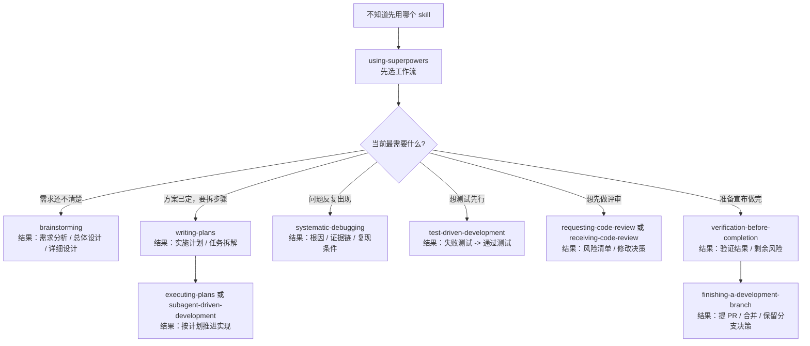

# Superpowers Skill Adapters

把 [`obra/superpowers`](https://github.com/obra/superpowers) 这套原版 skill 接到 `Cline`、`Droid`、`OpenCode`、`CodeBuddy` 四个宿主里，并补上中文触发和中文文档输出。

它不是把原版 skill 全文翻译成中文。它做的是“保留原版能力，再把中文使用体验补齐”。

## 一眼看懂：什么时候用哪个 skill



更详细的 skill 速查，看这里：

- [简化版能力矩阵](docs/compatibility-matrix.md)

## 这套东西能做什么

- 保留 14 个原版 skill 主体，核心内容仍以英文 `SKILL.md` 为准
- 让中文对话更容易触发需求分析、总体设计、详细设计、写计划、TDD、代码审查、收尾等工作流
- 让计划、评审、总结、方案等文档型输出默认用简体中文
- 未指定文件名时，优先使用中文文档名
- 支持 `Cline`、`Droid`、`OpenCode`、`CodeBuddy`

## 为什么装起来比较放心

- 一次安装、更新或重装，只会生成一个备份批次目录
- 备份统一进 `~/.superpowers-backups/<时间戳>/...` 或 `<项目根>/.superpowers-backups/<时间戳>/...`
- `AGENTS.md` 和 `CODEBUDDY.md` 只更新本适配仓库写入的专用说明段，不整文件覆盖
- 安装前会先显示“当前已装版本”和“准备安装版本”
- 发现已有安装时会先确认；删不掉旧文件时会直接停下，不会硬装
- `CodeBuddy` 已有 `language` 配置时不会被硬改

## 一分钟安装

当前官方支持环境：

- `Windows`
- `PowerShell 7`，命令是 `pwsh`
- `Git for Windows`

第一次安装到当前用户：

```powershell
pwsh .\scripts\powershell\install-all.ps1 -Targets All -Scope User
```

安装到当前项目：

```powershell
pwsh .\scripts\powershell\install-all.ps1 -Targets All -Scope Project -ProjectRoot E:\path\to\project
```

只装单个宿主：

```powershell
pwsh .\scripts\powershell\install-all.ps1 -Targets Cline -Scope User
pwsh .\scripts\powershell\install-all.ps1 -Targets Droid -Scope User
pwsh .\scripts\powershell\install-all.ps1 -Targets OpenCode -Scope User
pwsh .\scripts\powershell\install-all.ps1 -Targets CodeBuddy -Scope User
```

说明：

- `User` 是当前登录用户，不是整台机器所有账号
- 默认安装名带前缀 `superpowers-`

## 让 AI 帮你安装

如果你想让别的 AI agent 直接帮你安装，先让它读：

- [给 AI agent 的安装说明](docs/ai-agent-install.md)

你可以直接把这句提示词发给它：

```text
请先阅读这个仓库的 docs/ai-agent-install.md，然后用 User 模式帮我安装到 Cline、Droid、OpenCode、CodeBuddy。不要覆盖非 superpowers 专用说明段；如果需要更新已有安装，先明确告诉我会覆盖哪些内容。
```

## 四个宿主怎么用

| 宿主 | 你会得到什么 | 细节文档 |
| --- | --- | --- |
| `Cline` | 中文触发、中文文档输出、专用 rule 文件 | [Cline 使用说明](docs/cline-zh-prompts.md) |
| `Droid` | 中文触发、overlay、`AGENTS.md` 专用说明段 | [Droid 使用说明](docs/droid-zh-prompts.md) |
| `OpenCode` | 单文件 skill 入口、资源目录保留、`AGENTS.md` 专用说明段 | [OpenCode 使用说明](docs/opencode-zh-prompts.md) |
| `CodeBuddy` | 中文触发、`CODEBUDDY.md` 专用说明段、中文语言设置 | [CodeBuddy 使用说明](docs/codebuddy-zh-prompts.md) |

这些文档里会单独讲：

- 适合怎么触发
- 什么时候用自然中文说法
- 什么时候直接点名 `superpowers-writing-plans`
- 如果宿主支持 slash / command 形式，怎么写成 `/superpowers-writing-plans`

## 想改哪些中文词会触发哪些 skill

看这里：

- [自定义中文触发词](docs/customize-triggers.md)

最常见的做法就是改：

- [data/zh-cn-skill-triggers.json](data/zh-cn-skill-triggers.json)

改完后，重新执行一次安装脚本就会生效。

## 更新到新版本

更新这个适配仓库并重装：

```powershell
pwsh .\scripts\powershell\update-all.ps1 -Targets All -Scope User
```

刷新原版 skill 到最新 tag 再重装：

```powershell
pwsh .\scripts\powershell\refresh-upstream-and-reinstall.ps1 -Targets All -Scope User
```

如果你手上已经有新的原版 skill 本地目录：

```powershell
pwsh .\scripts\powershell\refresh-upstream-and-reinstall.ps1 -SourcePath E:\path\to\superpowers -Targets All -Scope User
```

## 继续看

- [给 AI agent 的安装说明](docs/ai-agent-install.md)
- [简化版能力矩阵](docs/compatibility-matrix.md)
- [中文使用总览](docs/zh-cn-usage-guide.md)
- [自定义中文触发词](docs/customize-triggers.md)
- [贡献与维护说明](CONTRIBUTING.md)
- [发布到 GitHub](docs/publishing-to-github.md)

## 许可证

- 本仓库自己的适配层代码和文档使用 [MIT License](LICENSE)
- vendored 原版 `obra/superpowers` 也使用 MIT，见 [NOTICE.md](NOTICE.md) 和 `vendor/superpowers/LICENSE`
