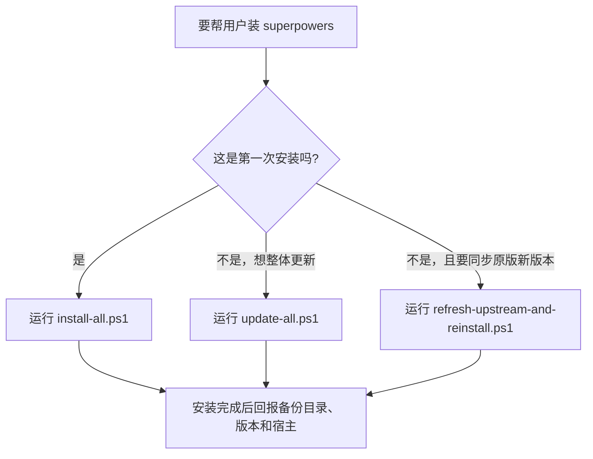

# 给 AI Agent 的安装说明

这份文档是给两类人用的：

- 你要把它发给另一个 AI agent，让它按这里的规则帮你安装
- 你自己想复制一段 prompt，让 AI 直接帮你装

如果你只是想尽快让 AI 帮你装，先看下面两段就够了：

- 先看“AI agent 应该遵守的安装规则”
- 再直接复制“推荐发给 AI 的 prompt”

## 先知道这几件事

- 当前官方只支持 `Windows + PowerShell 7 + Git for Windows`
- 默认安装到当前用户，不是整台电脑所有账号都生效的全局安装
- 默认安装名带前缀 `superpowers-`
- 不要自己猜宿主目录，优先直接调用仓库里的脚本

## 一句话原则

- 第一次安装就用 `install-all.ps1`
- 已经装过、只是想更新就用 `update-all.ps1`
- 想把上游新版本一起拉下来再更新，就用 `refresh-upstream-and-reinstall.ps1`
- 看到“会覆盖已有 superpowers 安装”时，先停下来告诉用户
- 删除旧文件失败时，不要硬装，按脚本提示让用户处理

## AI agent 应该遵守的安装规则

1. 先确认当前目录就是这个仓库根目录。
2. 第一次安装，用 `install-all.ps1`。
3. 已经装过、想整体更新，用 `update-all.ps1`。
4. 想同步上游仓库新版本，再重装，用 `refresh-upstream-and-reinstall.ps1`。
5. 不要整文件覆盖用户现有的 `AGENTS.md`、`CODEBUDDY.md` 或其他自定义配置。
6. 如果脚本提示“会覆盖已有 superpowers 安装”，在用户没同意前不要继续。
7. 如果旧文件自动删除失败，不要强行继续安装；把脚本提示的路径告诉用户。

## 安装决策图



## 最常用命令

全部宿主，安装到当前用户：

```powershell
pwsh .\scripts\powershell\install-all.ps1 -Targets All -Scope User
```

全部宿主，安装到当前项目：

```powershell
pwsh .\scripts\powershell\install-all.ps1 -Targets All -Scope Project -ProjectRoot E:\path\to\project
```

只装某一个宿主：

```powershell
pwsh .\scripts\powershell\install-all.ps1 -Targets Cline -Scope User
pwsh .\scripts\powershell\install-all.ps1 -Targets Droid -Scope User
pwsh .\scripts\powershell\install-all.ps1 -Targets OpenCode -Scope User
pwsh .\scripts\powershell\install-all.ps1 -Targets CodeBuddy -Scope User
```

已经装过，只想整体更新：

```powershell
pwsh .\scripts\powershell\update-all.ps1 -Targets All -Scope User
```

想把上游最新版本一起拉下来再重装：

```powershell
pwsh .\scripts\powershell\refresh-upstream-and-reinstall.ps1 -Targets All -Scope User
```

## 推荐直接发给 AI 的 prompt

### 1. 安装到当前用户

```text
请先阅读这个仓库的 README.md 和 docs/ai-agent-install.md，然后用 PowerShell 7 帮我安装 superpowers 到 Cline、Droid、OpenCode、CodeBuddy。要求：使用 User 模式；优先调用仓库自带脚本；不要覆盖非 superpowers 专用说明段；安装完成后告诉我备份目录、已安装宿主和当前上游版本。
```

### 2. 只装某几个宿主

```text
请先阅读 docs/ai-agent-install.md，然后只帮我安装到 Cline 和 OpenCode。使用仓库自带安装脚本，不要自己猜目录；如果发现已有 superpowers 安装，先明确告诉我会覆盖。
```

### 3. 安装到当前项目

```text
请先阅读 docs/ai-agent-install.md，然后把 superpowers 只安装到当前项目，不要装到用户目录。使用 Project 模式，并在完成后告诉我项目内生成了哪些目录和说明文件。
```

### 4. 更新现有安装

```text
请先阅读 docs/ai-agent-install.md，然后帮我把现有 superpowers 安装整体更新一遍。先告诉我当前已装版本和准备安装版本，再执行 update-all。不要覆盖非 superpowers 专用说明段；如果会覆盖已有安装，先提醒我确认。
```

## 推荐发给 AI 的最短版本

如果你只想给 AI 一句最短指令，可以用：

```text
请阅读 docs/ai-agent-install.md，并按里面的规则帮我安装或更新 superpowers。
```

## AI 装完后，最好回报这些信息

- 本次备份目录
- 当前已装的上游版本
- 准备安装的上游版本
- 实际安装到了哪些宿主
- 哪些文件被更新了
- 是否有需要用户手工处理的地方
