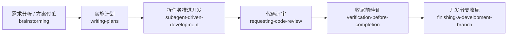

# Claude Code 使用说明

这份文档讲的是 `Claude Code + superpowers` 怎么更顺手地用。

和 `Codex`、`OpenCode` 这种需要多做一层转换的工具不同，`Claude Code` 本身就最接近上游 `superpowers` 的原始设计。我们这层适配主要补三件事：

- 中文触发更稳
- 中文文档输出更统一
- 默认文档路径和文件名更贴近中文团队的习惯

## 在 Claude Code 里，superpowers 是怎么工作的

- 简单说：这里不用硬改 workflow，本来就可以比较直接地按上游 skill 来跑。
- 这句话的意思是：`brainstorming`、`writing-plans`、`subagent-driven-development`、`requesting-code-review` 这些 skill，在 `Claude Code` 里基本可以按原意执行。
- 我们做的不是重写 skill，而是在 `~/.claude/skills` / `.claude/skills` 里安装带中文触发提示的 skill，再在 `CLAUDE.md` 里补一段中文输出约束。

## 先看这几条

- `Claude Code` 是当前最接近上游 `superpowers` 原始用法的工具。
- 中文适配主要通过 `CLAUDE.md` 和 skill 描述里的中文触发提示来生效。
- 代码、命令、路径、日志和接口名仍然建议保持原文。
- 文档型输出默认用简体中文；没指定文件名时，优先用中文文档名。
- 当前这个仓库的安装脚本仍然只官方支持 `Windows + PowerShell 7 + Git for Windows`。

## 先记住 2 种触发方式

### 1. 自然中文说法

例如：

- “先做需求分析和总体设计”
- “直接拆一份实施计划”
- “这个问题按 TDD 修”
- “先做代码审查再决定合不合”

### 2. 直接点名 skill

默认安装名带前缀 `superpowers-`，所以建议写完整名字：

- `superpowers-brainstorming`
- `superpowers-writing-plans`
- `superpowers-subagent-driven-development`
- `superpowers-requesting-code-review`

## Claude Code 最适合怎么理解

- 这里不是“把上游翻译成别的工具”
- 而是保留上游 workflow，本仓库只补中文触发和中文文档默认值

你可以把它理解成：

- 上游 skill 负责方法论和流程
- 本仓库负责把中文团队更常见的说法、文档命名和文档语气补齐

## 常用工作流



## 启动工作流

```text
这件事按 superpowers 工作流来。你先判断当前阶段该用哪些 skill，再按原生 workflow 推进；计划、结论和评审文档用中文输出。
```

## 新功能从零开始

```text
我要做一个新的分享功能。先不要直接实现，先做需求澄清、方案对比和总体设计，结论用中文输出。
```

## 写实施计划

```text
方向已经确定，帮我直接拆成实施计划。保存位置如果我指定了就按我指定的来；没指定时按仓库现有文档习惯放，并明确告诉我计划文件是哪一份。步骤要具体到改哪些文件、怎么验证，中文输出。
```

## 计划驱动开发

```text
按刚写好的那份计划推进开发，不要重新从 TODO 或任务清单改选范围。能拆开的任务就按 plan 拆给 subagent，最后由主线程统一整合、验证和收尾。
```

## 请求代码审查

```text
这批改动先做一次严格代码审查，重点检查需求符合度、回归风险、遗漏测试和计划偏差，结论用中文。
```

## 完成前验证

```text
先别说完成。先把验证清单跑完，把通过项、失败项、没跑项和剩余风险分开写清楚，再决定是否收尾。
```

## 想改中文触发词

- [自定义中文触发词](customize-triggers.md)
