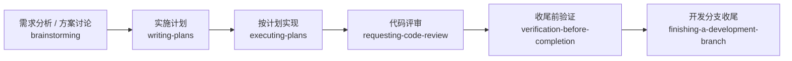

# Cline 使用说明

这份文档讲的是 `Cline + superpowers` 怎么更顺手地用。

重点不是“背术语”，而是知道什么时候用自然中文说法，什么时候直接点名 skill。

## 在 Cline 里，superpowers 是怎么工作的

- 简单说：它会把上游 workflow 翻成更适合 `Cline` 的用法，并在高风险步骤上更保守一点。
- 这句话的意思是：上游 `superpowers` 原本是按 `Claude Code` 写的，我们在 `Cline` 里不是逐字照搬，而是翻成 `Cline` 自己更接近的做法。
- 为什么这样：`Cline` 能承接大部分规划、调试、TDD、review 工作流，但像可写 subagent、`TodoWrite` 这类上游假设，并不是一模一样的能力边界。
- 所以在 `Cline` 里，凡是上游要求“多个 agent 直接并行改代码”的地方，我们会保守一点，改成“并行调研 / 并行比选，主线程实施和收尾”。
- 这不是阉割功能，而是为了少出互相覆盖、上下文跑偏、最后不好收口的问题。

## 先记住 3 种触发方式

### 1. 自然中文说法

最推荐，直接这样说就行：

- “先做需求分析和总体设计”
- “先把这个需求拆成实施计划”
- “这个 bug 用 TDD 修”
- “先做代码审查”

### 2. 直接点名 skill

默认安装名带前缀 `superpowers-`，所以建议写完整名字：

- `superpowers-brainstorming`
- `superpowers-writing-plans`
- `superpowers-systematic-debugging`
- `superpowers-finishing-a-development-branch`

### 3. 如果这个工具支持 slash / command 形式

也优先写完整名字：

- `/superpowers-writing-plans`
- `/superpowers-finishing-a-development-branch`

注意：

- 默认安装下，不建议直接写 `/writing-plans`
- 默认安装下，也不建议直接写 `/finishing-a-development-branch`
- 只有你安装时显式用了 `-NamePrefix ''`，才更适合不带前缀的名字

## Cline 最适合怎么理解

- `Cline` 里涉及多个 agent 时，更适合“并行调研，主线程实施”
- 所以 `dispatching-parallel-agents` 和 `subagent-driven-development` 在 Cline 里都更偏“并行调研 + 主线程改代码”
- 如果你希望输出中文文档，直接写“计划 / 说明 / 结论用中文”就够了

你可以把它理解成：

- 单 agent 工作流，基本都能正常接住
- 多 agent 工作流，不是不能用，而是按更稳的方式落地
- 如果 `Cline` 自己没有和上游完全对等的实现，我们优先保留工作流意图，不硬照搬字面动作

## 常用工作流



## 启动工作流

适合刚开新会话时：

```text
这件事按 superpowers 工作流来。你先判断该用哪些 skill，再开始。
```

如果你已经知道要先规划：

```text
这个需求先别写代码，先按 superpowers 流程做需求澄清和方案讨论。
```

## 新功能从零开始

适合一个新需求还没定方案时：

```text
我要加一个导出功能。先不要直接改代码，先一起做需求澄清、方案对比和边界讨论，结论用中文输出。
```

如果你希望它自然进入计划阶段：

```text
我们要做一个批量导出功能。先 brainstorm，确定方案后把实施计划拆出来，计划和说明都用中文。
```

## 已有方案，直接写计划

适合需求和方向已经明确时：

```text
方案已经定了，你直接把它拆成可执行的实施计划，步骤要具体到文件和验证方式，中文输出。
```

## 已有计划，继续实现

适合你已经有 plan，希望继续往下做：

```text
计划已经在当前上下文里了，按计划继续实现。需要并行时只让 subagent 做调研和比选，代码改动由主线程完成。
```

## 并行调研

这是 Cline 版的正确说法，因为它的 subagent 更适合调研而不是直接改文件：

```text
这个任务拆成几块并行调研：一块查现有架构，一块查相近实现，一块查风险点。调研结果汇总后由你主线程统一改代码。
```

## Bug 排查

适合不想让 agent 直接猜修复时：

```text
这个测试偶发失败。先系统排查根因，不要先给修复方案。先收集证据、缩小范围、确认复现条件，再决定怎么改。
```

## TDD 修复

适合明确要求测试先行：

```text
这个 bug 用 TDD 修。先写失败测试，确认失败，再做最小改动让它通过，最后再看是否需要重构。
```

## 请求代码审查

适合实现后让它先 review 一轮：

```text
这批改动先做一次严格代码审查，重点看行为回归、边界条件、缺失测试和和计划不一致的地方，结论用中文。
```

## 处理收到的 Review 意见

适合你已经拿到了外部 review 评论：

```text
我收到一批 code review 意见。先帮我判断哪些意见成立、哪些需要反驳、哪些需要补充验证，然后再决定怎么改。
```

## 完成前验证

适合防止 agent 过早说“好了”：

```text
别急着说完成。先按 verification-before-completion 的思路把该跑的验证跑完，再根据结果判断是否真的修好。
```

## 分支收尾

适合决定提 PR、合并还是保留：

```text
这轮改动做完了。帮我收尾这个开发分支：先确认验证结果，再判断是提 PR、直接合并、继续保留还是丢弃。
```

## 写 Skill

适合继续扩展这套适配：

```text
我要给这个 agent 体系补一个新 skill。先帮我定义触发场景、复用资源和 SKILL.md 结构，再写出首版内容并校验。
```

## Cline 使用要点

- 在 Cline 里，涉及多个 agent 的话，最好明确写出“调研并行，主线程实施”，这样最符合当前能力边界。
- 如果你希望输出中文文档，直接写“计划/说明/结论用中文”，不要要求代码和标识符翻译。
- 如果上下文里已经有计划，直接说“按计划继续实现”，不要重复让它再 brainstorm 一轮。

## 想改中文触发词

- [自定义中文触发词](customize-triggers.md)
