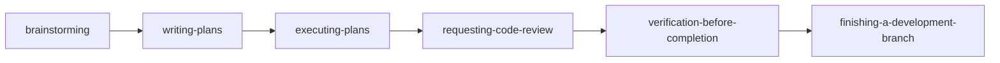

# CodeBuddy 使用说明

这份文档讲的是 `CodeBuddy + superpowers` 怎么更顺手地用。

重点是让中文对话更稳定地命中对应 skill，同时让产出的计划、评审、总结默认用中文。

## 先记住 3 种触发方式

### 1. 自然中文说法

例如：

- “先做需求分析和总体设计”
- “先把这个需求拆成实施计划”
- “这个改动先做代码审查”

### 2. 直接点名 skill

默认安装名带前缀 `superpowers-`，所以建议写完整名字：

- `superpowers-brainstorming`
- `superpowers-writing-plans`
- `superpowers-finishing-a-development-branch`

### 3. 如果宿主支持 slash / command 形式

也优先写完整名字：

- `/superpowers-writing-plans`
- `/superpowers-finishing-a-development-branch`

## CodeBuddy 最适合怎么理解

- `CodeBuddy` 的项目级 skill 结构和 `CODEBUDDY.md` 规则很适合中文触发和中文文档输出
- 对多代理 / 并行类 skill，当前更适合按“隔离面拆分 + 主线程收口”理解

## 常用工作流



## 启动工作流

```text
这件事按 superpowers 工作流来。你先判断该用哪些 skill，再开始推进。
```

## 从零开始的新需求

```text
我要做一个新功能。先不要直接写代码，先做需求澄清、方案对比和设计取舍，结论用中文输出。
```

## 写实施计划

```text
方案已经定了，你直接把它拆成实施计划。步骤要落到具体文件和验证方式，中文输出。
```

## 按计划继续实现

```text
计划已经有了，按计划继续实现。能拆成隔离工作面的部分再并行推进，但最后统一由主线程整合和验证。
```

## Bug 排查

```text
这个问题先系统排查根因，不要直接给修复方案。先收集证据、确认影响范围，再决定怎么改。
```

## TDD 修复

```text
这个 bug 用 TDD 修。先写失败测试，再做最小修复，最后确认是否需要重构。
```

## 请求代码审查

```text
这批改动先做代码审查，重点检查行为回归、边界条件、缺失测试和实现是否偏离计划，结论用中文。
```

## 处理 Review 反馈

```text
这里有一批 review 意见。先判断哪些成立、哪些需要补证据、哪些可以保留不同意见，再决定怎么改。
```

## 完成前验证

```text
别急着说完成。先跑完验证，把通过项、失败项和剩余风险分开列出来，再决定是否可以收尾。
```

## CodeBuddy 使用要点

- 项目级安装优先使用 `.codebuddy/skills` 和项目根 `CODEBUDDY.md`。
- 对多代理/并行类 upstream skill，当前更适合按“隔离面拆分 + 主线程收口”来执行。
- 如果你希望新文档文件直接用中文名，可以明确补一句“未指定文件名时用中文文档名”。

## 想改中文触发词

- [自定义中文触发词](customize-triggers.md)
