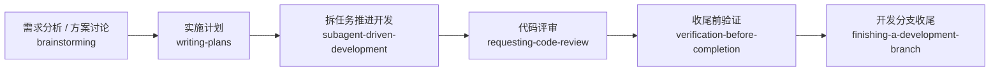

# Codex 使用说明

这份文档讲的是 `Codex + superpowers` 怎么更顺手地用。

`Codex` 现在可以比较自然地承接 `superpowers`，但它和上游 `Claude Code` 仍然不是完全一比一。差异主要在两处：

- 上游提到的命名 reviewer agent，在 `Codex` 里更接近“用 `worker` subagent + prompt 模板”来实现
- `Codex App` 里经常已经处在宿主管理的 linked worktree / detached HEAD 环境，`using-git-worktrees` 和 `finishing-a-development-branch` 不能照字面硬跑

## 在 Codex 里，superpowers 是怎么工作的

- 简单说：`Codex` 有原生 skills、原生 subagents，也能比较顺手地承接 `superpowers`。
- 但和 `Claude Code` 不同，这里要额外注意宿主管理 worktree、受限分支操作和 handoff。
- 我们做的事是：把 skill 安装到 `.agents/skills`，再在 `AGENTS.md` 里补一段中文输出和 Codex 兼容约束。

## 先看这几条

- `Codex` 不是“不支持 superpowers”，而是部分 skill 需要按 Codex 的原生能力重新解释。
- 在 `Codex App` 里，如果当前已经是 linked worktree 或 detached HEAD，不要再盲目新建 worktree。
- 如果 sandbox 挡住了 `git checkout -b`、`git push` 或 PR 创建，正确做法是提交当前工作并 handoff，不是假装这些动作已经成功。
- 中文适配主要通过 `AGENTS.md` 和 skill 描述里的中文触发提示来生效。
- 当前这个仓库的安装脚本仍然只官方支持 `Windows + PowerShell 7 + Git for Windows`。

## 先记住 3 种触发方式

### 1. 自然中文说法

例如：

- “先做需求分析和总体设计”
- “直接拆一份实施计划”
- “这个任务拆成几块并行推进”
- “先做代码审查再说完成”

### 2. 直接点名 skill

默认安装名带前缀 `superpowers-`，所以建议写完整名字：

- `superpowers-writing-plans`
- `superpowers-subagent-driven-development`
- `superpowers-finishing-a-development-branch`

### 3. 用 Codex 的 skill 选择方式显式调用

优先写完整名字：

- `$superpowers-writing-plans`
- `$superpowers-finishing-a-development-branch`

如果你想先浏览可用 skill，也可以先用 `/skills` 再选。

## Codex 最适合怎么理解

- `Codex` 可以原生用 skill 和 subagent
- 但 App 场景下的 git/worktree 环境，不一定和上游 `Claude Code` 假设一致

你可以把它理解成：

- 上游 workflow 仍然有价值
- 只是需要把“命名 agent”“worktree 收尾”这些动作翻成 `Codex` 真正能做的方式

## 常用工作流



## 启动工作流

```text
这件事按 superpowers 工作流来。你先判断当前阶段该用哪些 skill，再结合 Codex 自己的 skill / subagent 能力推进；计划、结论和评审文档用中文输出。
```

## 写实施计划

```text
方向已经确定，帮我直接拆成实施计划。保存位置如果我指定了就按我指定的来；没指定时按仓库现有文档习惯放，并明确告诉我计划文件是哪一份。步骤要具体到改哪些文件、怎么验证，中文输出。
```

## 计划驱动开发

```text
按刚写好的那份计划推进开发，不要重新从 TODO 或任务清单改选范围。能拆开的任务再拆给 subagent，最后由主线程统一整合、验证和收尾。
```

## 如果当前线程已经在 worktree 里

```text
先检查当前是不是宿主管理的 linked worktree / detached HEAD。是的话就不要再建新的 worktree；直接在当前目录做 setup、baseline check 和实现。收尾时如果分支/推送受限，就提交当前工作并给我明确 handoff 信息。
```

## 请求代码审查

```text
这批改动先做一次严格代码审查，重点检查需求符合度、回归风险、遗漏测试和计划偏差。需要 reviewer subagent 时，按 Codex 的 worker 方式派发，不要假设命名 agent 一定存在。
```

## 完成前验证

```text
先别说完成。先把验证清单跑完，把通过项、失败项、没跑项和剩余风险分开写清楚，再决定是否收尾。
```

## 想改中文触发词

- [自定义中文触发词](customize-triggers.md)
