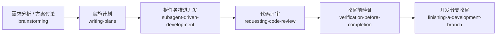

# Droid 使用说明

这份文档讲的是 `Droid + superpowers` 怎么更顺手地用。

相比 `Cline`，`Droid` 更适合把边界清晰的任务真正委派出去。

## 在 Droid 里，superpowers 是怎么工作的

- 简单说：`Droid` 比较适合真的把独立任务分出去做，但最后还是由主线程统一收口。
- 这句话的意思是：上游 `superpowers` 里提到的多 agent、委派、并行推进，在 `Droid` 里更接近原意，因为它自己的 `Factory` 委派能力本来就比较顺手。
- 为什么这样：`Droid` 比较适合把边界清楚、互不重叠的任务真正分给不同 agent 去做，而不是只做并行调研。
- 但最后还是要求主线程收口，因为跨任务整合、冲突处理、最终验收和是否可以宣布完成，放在主线程更稳。
- 所以你看到这里经常强调“能真委派，但不要让多个 agent 抢同一批文件”，这不是保守过头，而是为了避免后面难整合。

## 先看这几条

- `Droid` 更适合把“目录边界清楚、文件面不重叠”的任务真正分给不同 agent。
- 即使允许并行，也最好要求每个子任务回报 touched files、验证结果和 residual risks。
- 最后的整合、冲突处理和收尾判断，仍然建议由主线程完成。
- 写计划时不用死盯固定目录；你如果指定了保存位置就按你的要求来，没指定时再沿用仓库现有文档习惯。

## 先记住 3 种触发方式

### 1. 自然中文说法

例如：

- “先做需求分析和总体设计”
- “把这个任务拆成几个独立子任务并行推进”
- “先跑完验证再说完成”

### 2. 直接点名 skill

默认安装名带前缀 `superpowers-`，所以建议写完整名字：

- `superpowers-dispatching-parallel-agents`
- `superpowers-subagent-driven-development`
- `superpowers-verification-before-completion`

### 3. 如果这个工具支持 slash / command 形式

也优先写完整名字：

- `/superpowers-dispatching-parallel-agents`
- `/superpowers-finishing-a-development-branch`

## Droid 最适合怎么理解

- `Droid` 比 `Cline` 更适合把“目录边界清楚、文件面不重叠”的任务真正分给不同 agent
- 即使允许并行，最后的整合、冲突处理和收尾判断仍建议由主线程完成

你可以把它理解成：

- 并行类 skill 在 `Droid` 里，通常不是“降级成只做调研”
- 如果任务边界足够清楚，可以真的并行推进实现
- 但主线程仍然负责最后拍板、整合和验收

## 常用工作流



## 启动工作流

适合刚开新会话时：

```text
这件事按 superpowers 工作流来。你先判断当前阶段该用哪些 skill，再开始推进。
```

## 新功能从零开始

适合需求还没收敛时：

```text
我要做一个新的分享功能。先不要直接实现，先做需求澄清、方案对比和设计取舍，结论用中文输出。
```

## 写实施计划

适合已经知道方向，但还没拆任务：

```text
方向已经确定，帮我把它拆成实施计划。保存位置如果我指定了就按我指定的来；没指定时按仓库现有文档习惯放，并明确告诉我计划文件是哪一份。每一步要能独立执行，并说明验证方式，中文输出。
```

## 计划驱动开发

适合你希望 Droid 真正分工推进：

```text
按刚写好的那份计划推进开发，不要重新从 TODO 或任务清单改选范围。把边界清晰的任务拆出去并行处理，但最后由主线程统一整合、校验和收口。
```

## 多代理并行开发

适合有多个互不干扰的工作面：

```text
这个需求拆成三个独立子任务并行推进：接口层、前端展示层、测试补充。每个子任务都要汇报改动文件、验证结果和未解决风险。
```

## Bug 排查

适合先定位问题再决定是否派发修复：

```text
这个线上问题先做系统排查，确认根因和影响范围。只有根因明确后，再决定是否拆给不同 agent 分别修复和验证。
```

## TDD 修复

适合带着明确约束做 bugfix：

```text
这个问题按 TDD 修。先补失败测试，再做最小修复；如果需要委派，测试和实现的边界要明确分开。
```

## 请求代码审查

适合在整合前做一次 review：

```text
这批改动先做代码审查，重点检查需求符合度、回归风险、遗漏测试和多 agent 产物之间是否有不一致。
```

## 处理 Review 反馈

适合 review 回来后再决策：

```text
这里有一批 review 反馈。先判断哪些必须改、哪些需要补证据、哪些可以保留不同意见，然后再安排修改。
```

## 完成前验证

适合防止“做完了但没证据”：

```text
先别宣布完成。把验证清单跑完，并把通过项、失败项和剩余风险分开列出来，再决定是否可以收尾。
```

## 分支收尾

适合决定提 PR 或继续留分支：

```text
当前开发分支准备收尾。先确认验证和 review 状态，再判断应该提 PR、直接合并、继续保留还是关闭。
```

## 写 Skill

适合扩展 Droid 自己的 skill 体系：

```text
我要补一个新的 agent skill。先定义触发语义和典型用法，再写 SKILL.md，并验证中文触发词是否足够清晰。
```

## 想改中文触发词

- [自定义中文触发词](customize-triggers.md)
