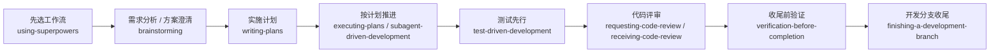

# Superpowers 中文使用总览

这套适配不是把原版 skill 全部翻成中文，而是让你可以更自然地用中文把原版能力叫出来。

你可以把它理解成：

- skill 主体还是原版
- 触发方式更适合中文对话
- 文档型输出默认是中文
- 文档型文件默认优先放 `docs/`
- 文档说明默认尽量写得通俗易懂

## 几个核心 Skill 怎么理解

- `brainstorming`：先把需求、边界、方案聊清楚
- `writing-plans`：直接把实施计划、接口设计、数据结构、Redis / S3 设计、字段说明写出来
- `executing-plans`：按已经写好的文档开始实现
- `test-driven-development`：先写失败测试，再改代码
- `systematic-debugging`：先定位问题，再决定怎么修

最容易混的是前两个：

- 如果你还在说“先想清楚怎么做”“先比一比方案”，更接近 `brainstorming`
- 如果你已经知道要什么，只是想让它直接写出 `接口设计.md`、`Redis设计.md`、`S3设计.md`、`字段说明.md` 这类文档，更接近 `writing-plans`

这只是中文适配层里的分工习惯，不是把上游 skill 重写了一遍。上游原始 `SKILL.md` 还在，我们只是把中文触发词和常见交付场景分得更直白。

## 默认文档落点和写法

如果 skill 需要新建计划、评审、设计说明、复盘这类文档，而你又没有指定路径和文件名，当前默认规则是：

- 优先放到 `docs/`
- 文件名优先用中文，例如 `实施计划.md`、`代码评审.md`、`问题排查.md`
- 如果内容本身就是接口、字段、表结构、Redis、S3 这类设计，优先用更贴近内容的名字，例如 `接口设计.md`、`数据结构设计.md`、`表结构设计.md`、`Redis设计.md`、`S3设计.md`、`字段说明.md`
- 如果你在对话里直接说 `redis设计`，默认文件名会优先规范成 `Redis设计.md`；`S3设计` 也是同样处理
- 正文默认用简体中文
- 代码、命令、路径、日志、接口名这类内容保留原文
- 技术术语尽量少堆，能用通俗中文讲清楚就先用通俗中文

常见结果大概会像这样：

```text
docs/
  需求分析.md
  总体设计.md
  详细设计.md
  接口设计.md
  数据结构设计.md
  实施计划.md
  Redis设计.md
  S3设计.md
```

如果你已经明确说了路径或文件名，例如“把计划写到 `specs/iteration-2-plan.md`”，那就优先按你的要求来，不会强行改成中文名。

## 触发 skill 的 3 种常见方式

### 1. 直接说自然中文

例如：

- “先做需求分析和总体设计”
- “先把方案和边界想清楚，再决定怎么做”
- “补一版详细设计”
- “先把这个需求拆成实施计划”
- “直接给我一版接口设计和数据结构设计”
- “把 Redis设计 和 S3设计 也一起补上”
- “设计定了以后，顺手把接口文档和字段说明骨架列出来”
- “这个 bug 用 TDD 修”
- “先补单元测试和集成测试”
- “先做代码审查”

这是最推荐的方式。

### 2. 直接点名 skill

默认安装名带前缀 `superpowers-`，所以直接点名时，建议写完整名字：

- `superpowers-brainstorming`
- `superpowers-writing-plans`
- `superpowers-systematic-debugging`
- `superpowers-finishing-a-development-branch`

### 3. 如果你用的工具支持 slash / command，直接调用

如果你用的工具支持 `/...` 这类形式，优先也写完整名字：

- `/superpowers-writing-plans`
- `/superpowers-finishing-a-development-branch`

注意：

- 默认安装下，不建议直接写 `/writing-plans`
- 默认安装下，也不建议直接写 `/finishing-a-development-branch`
- 只有你安装时显式用了 `-NamePrefix ''`，才更适合不带前缀的名字

## 一条最常见的工作流



## 按工具看更详细的用法

- [Cline 使用说明](cline-zh-prompts.md)
- [Droid 使用说明](droid-zh-prompts.md)
- [OpenCode 使用说明](opencode-zh-prompts.md)
- [CodeBuddy 使用说明](codebuddy-zh-prompts.md)

这些文档里会分别讲：

- 哪些说法更容易命中
- 哪些场景适合直接点名 skill
- 哪些场景适合并行，哪些更适合主线程收口

## 想自己改中文触发词

看这里：

- [自定义中文触发词](customize-triggers.md)

## 想先看能力速览

看这里：

- [简化版能力矩阵](compatibility-matrix.md)
